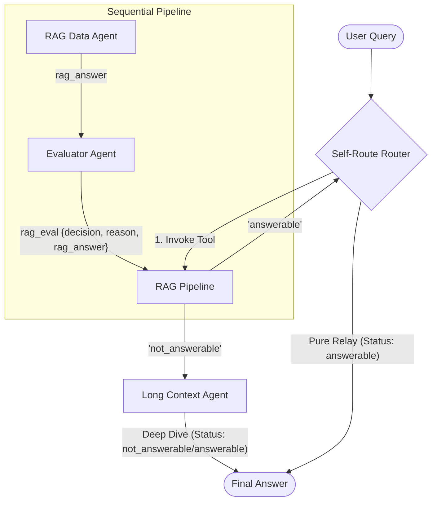

# Self-Route LLM Agent Architecture

> [!IMPORTANT]
> This project is created for research and demonstration purposes to showcase the implementation of the **Self-Route** method. A production-grade enterprise system would include additional components such as robust authentication, complex ETL pipelines, and specialized monitoring. For this demo, we use Google Vertex AI Search for RAG simplicity and a local `docs/` folder for the Long Context example. This solution is designed to be extensible and can be upgraded for production scenarios.

## 📖 About the Paper

This project is a practical implementation of **Self-Route**, a method introduced in the paper [**"Retrieval Augmented Generation or Long-Context LLMs? A Comprehensive Study and Hybrid Approach"**](https://arxiv.org/abs/2407.16833) (arXiv:2407.16833).

### How Self-Route actually works (step-by-step)

The paper proposes a two-stage routing pipeline:

- **Step 1 — Run cheap RAG first**
  - Retrieve top-k chunks.
  - Ask the LLM to answer only from those chunks.
  - Add instruction: _"If not answerable, output ‘unanswerable’"_.
  - So the model tries using small context (cheap). This is the self-evaluation step.
- **Step 2 — Only if needed → fallback to Long Context**
  - If model says "unanswerable" → Then run expensive full-context LC model.
  - Otherwise: Accept RAG answer and Stop (no long context cost).

**Why this reduces cost**: In many queries, RAG answer = Long-context answer, so running LC is wasteful. The paper found >60% of queries produce identical outputs, meaning long context was unnecessary. Self-Route uses RAG first (cheap) and only escalates ~15–40% of time, keeping near-LC accuracy but much lower token cost.

**Important**: This is NOT "predict before running". They actually try RAG, ask the model "are you confident?", and only then decide. Routing signal = model self-confidence / self-reflection.

## 🏗️ Core Architecture

The system utilizes a **Self-Reflective Router** that orchestrates between a high-speed RAG pipeline and a high-precision Long-Context fallback.



1. **RAG Data Agent** — Searches the Vertex AI Datastore. Strictly grounded to GlobalCorp policies.
2. **Evaluator Agent** — A structured Pydantic judge that validates the RAG output. If the result is ungrounded or missing, it issues a `not_answerable` signal.
3. **Long Context (LC) Agent** — The ultimate fallback. Ingests raw text files directly for deep reading comprehension, capturing details that RAG chunks might miss.

## 📂 Repository Structure

```
Self-Route LLM/
│
├── README.md                    # This file (Architecture & Setup)
├── generate_rag_files.py        # Procedurally generate .pdf / .docx for RAG Datastore
│
└── rag_lc_agent/                # Main Agent Module
    ├── README.md                # Module architecture & components
    ├── agent.py                 # Root Conversational Router (Self-Route entrypoint)
    ├── config.py                # Environment & Configuration manager
    ├── instructions.py          # Unified system prompts (RAG, Eval, LC, Router)
    ├── tool.py                  # Long Context ingestion utility
    │
    ├── subagents/               # Agent definitions
    │   ├── rag.py               # Vertex AI Search Agent
    │   ├── evaluator.py         # Structured Evaluator (Pydantic schema)
    │   └── long_context.py      # Full-context Fallback Agent
    │
    ├── tests/                   # Validation Framework
    │   ├── test_data.py         # 12 Categorized test cases
    │   ├── eval_metrics.py      # LLM-as-a-Judge scoring (1-5 scale)
    │   └── run_evals.py         # Automated execution script → evaluation_results.csv
    │
    └── docs/                    # Ground-truth policies for Long Context Agent
        ├── remote_work_policy.txt
        ├── travel_policy.txt      # Detailed Travel & Per Diem
        ├── code_of_conduct.txt
        └── parental_leave_appendix.txt # Detailed edge cases
```

## ⚙️ Setup Instructions

### 1. Prerequisites

Python 3.10+ and a Google Cloud Project with Vertex AI Search enabled.

### 2. Install Dependencies

```bash
pip install -r requirements.txt
```

### 3. Configure Environment

Populate `rag_lc_agent/.env` with your project and datastore details. Example:

```bash
GOOGLE_GENAI_USE_VERTEXAI=1
GOOGLE_CLOUD_PROJECT=your-project-id
GOOGLE_CLOUD_LOCATION=us-central1
DATASTORE_RESOURCE=projects/<PROJECT_NUMBER>/locations/global/collections/default_collection/dataStores/<DATASTORE_ID>
SEARCH_ENGINE_ID=projects/<PROJECT_NUMBER>/locations/global/collections/default_collection/engines/<ENGINE_ID>
DOCS_FOLDER=./docs
MAX_RESULTS=3
AGENT_MODEL=gemini-2.5-flash
```

### 4. Seed RAG Datastore

Run the generator and upload the files in `rag_docs_to_upload/` to your Vertex AI Search datastore:

```bash
python generate_rag_files.py
```

## 🚀 Running the Agent

### Start Conversational Web UI

```bash
adk web
```

### Run Automated Evaluation Suite

```bash
python -m rag_lc_agent.tests.run_evals
```

### 📊 Evaluation Strategy

This runs **12 baseline test queries** across **4 strict categories** as defined in the codebase:

1.  **RAG Unique**: Information specifically available only in the RAG datastore.
2.  **RAG > LC**: Information where the RAG context (extracted chunks) is superior to the local text summaries.
3.  **LC > RAG**: Specific policy details (e.g., specific dollar amounts or per diems) found in local docs but missing/summarized in RAG.
4.  **LC Unique**: Complex synthesis or hidden data points requiring a full document scan (e.g., hotline numbers, specific nightly rates).

> [!NOTE]
> All test cases and ground truth data were generated using AI for research and demonstration purposes.

---

## ✍️ Author & Connect

If you found this project helpful, please **star the repository**! 🌟

- **Medium**: [Read more articles on AI & RAG](https://medium.com/@pandeyrahulraj99)
- **LinkedIn**: [Connect with me on LinkedIn](https://www.linkedin.com/in/rahulraj31/)
