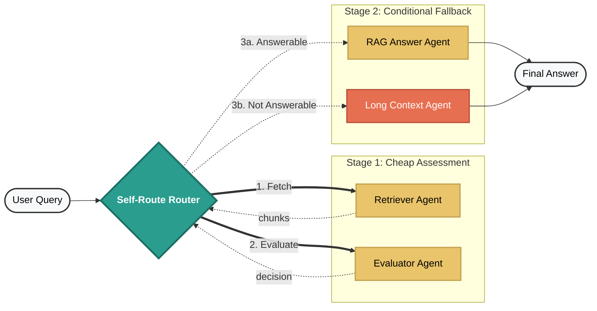

# Self-Route LLM Agent Architecture

> [!IMPORTANT]
> This project is created for research and demonstration purposes to showcase the implementation of the **Self-Route** method. A production-grade enterprise system would include additional components such as robust authentication, complex ETL pipelines, and specialized monitoring. For this demo, we use Google Vertex AI Search for RAG simplicity and a local `docs/` folder for the Long Context example. This solution is designed to be extensible and can be upgraded for production scenarios.

## 📖 About the Paper

This project implements **Self-Route**, as described in [**"Retrieval Augmented Generation or Long-Context LLMs? A Comprehensive Study and Hybrid Approach"**](https://arxiv.org/abs/2407.16833).

### How Self-Route actually works (step-by-step)

The paper proposes a two-stage routing pipeline:

- **Step 1 — Run cheap RAG first**
  - Retrieve top-k chunks.
  - Ask the LLM to answer only from those chunks.
  - Add instruction: _"If not answerable, output ‘unanswerable’"_.
  - So the model tries using small context (cheap). This is the self-evaluation step.
- **Step 2 — Only if needed → fallback to Long Context**
  - If model says "unanswerable" → Then run expensive full-context LC model.
  - Otherwise: Accept RAG answer and Stop (no long context cost).

**Why this reduces cost**: In many queries, RAG answer = Long-context answer, so running LC is wasteful. The paper found >60% of queries produce identical outputs, meaning long context was unnecessary. Self-Route uses RAG first (cheap) and only escalates ~15–40% of time, keeping near-LC accuracy but much lower token cost.

**Important**: This is NOT "predict before running". They actually try RAG, ask the model "are you confident?", and only then decide. Routing signal = model self-confidence / self-reflection.

## 🛠️ Setup & Installation

### 1. Environment Setup

Create and activate a virtual environment:

```bash
python -m venv venv
source venv/bin/activate  # On Windows: venv\Scripts\activate
```

### 2. Install Dependencies

```bash
pip install google-adk google-cloud-aiplatform python-dotenv
```

### 3. Configure Environment Variables

Create a `.env` file in the `rag_lc_agent/` directory with the following structure:

```env
# Google Cloud Configuration
GOOGLE_GENAI_USE_VERTEXAI=1
GOOGLE_CLOUD_PROJECT="your-project-id"
GOOGLE_CLOUD_LOCATION="us-central1"

# RAG Configuration
DATASTORE_RESOURCE="projects/YOUR_PROJECT/locations/global/collections/default_collection/dataStores/YOUR_DATASTORE"
SEARCH_ENGINE_ID="projects/YOUR_PROJECT/locations/global/collections/default_collection/engines/YOUR_ENGINE"

# Agent Tuning
AGENT_MODEL="gemini-2.5-flash"
MAX_RESULTS=3
DOCS_FOLDER="./docs"
```

## 🏗️ Core Architecture

The updated architecture uses a **Pre-Generation Evaluator Gate** to optimize routing before the final answer is generated.

### Architecture Overview (Text)

```
Self Route
├── Retriever Agent
├── Evaluator Agent
│   ├── answerable → RAG Agent
│   └── not_answerable → Long Context Agent
```

### Routing Flow (Diagram)



### Agent Responsibilities

- **Retriever Agent**: Fetches top-k document chunks from Vertex AI Search.
- **Evaluator Agent**: Decides if chunks are sufficient to answer the query (pre-generation gate).
- **RAG Agent**: Generates a grounded answer using only the retrieved chunks (triggered only if answerable).
- **Long Context Agent**: Performs deep-reading synthesis across full document texts (triggered only if not answerable).

## 📂 Repository Structure

```
Self-Route LLM/
├── README.md                    # This file (Architecture & Setup)
└── rag_lc_agent/                # Main Agent Module
    ├── agent.py                 # Self-Route Router (4-tool Orchestrator)
    ├── subagents/
    │   ├── retreiver.py         # [NEW] Chunk fetcher
    │   ├── evaluator.py         # Pre-eval logic (gatekeeper)
    │   ├── rag.py               # RAG generation agent
    │   └── long_context.py      # Full-context Fallback Agent
    ├── tests/
    │   ├── test_data.py         # 6 Categorized benchmark cases
    │   └── run_evals.py         # Automated evaluation script
    └── docs/                    # Ground-truth policies for Long Context
```

## 🚀 Evaluation Pipeline (`run_evals.py`)

The evaluation script validates the routing logic by capturing:

1.  **Route**: Which path was taken (`rag` or `long_context`).
2.  **Final Answer**: The actual response text.
3.  **LLM-as-a-Judge Scores**: Correctness, Faithfulness, and Completeness.

### CSV Output Format

| Column              | Description                                             |
| :------------------ | :------------------------------------------------------ |
| **Category**        | The test category (RAG_ONLY, AMBIGUOUS, etc.)           |
| **Query**           | The user input                                          |
| **Ground Truth**    | The reference answer from the source documents          |
| **Expected Route**  | The ground-truth routing path (`rag` or `long_context`) |
| **Actual Route**    | The actual path taken by the agent                      |
| **Route Correct**   | Boolean (True/False) comparison                         |
| **Final Answer**    | The actual text response returned                       |
| **Correctness**     | Judge score (1-5)                                       |
| **Faithfulness**    | Judge score (1-5)                                       |
| **Completeness**    | Judge score (1-5)                                       |
| **Judge Reasoning** | The LLM's explanation for the scores                    |

## 📊 Evaluation Strategy

This runs benchmark test queries across **6 strict categories**:

1.  **RAG_ONLY**: Single fact answerable via standard retrieval.
2.  **LONG_CONTEXT_ONLY**: High-precision answer exists only in the full local document.
3.  **AMBIGUOUS**: Query missing constraints requiring a full policy scan and router routing to long context.
4.  **FAIL_RETRIEVAL**: Cases where the retriever returns incorrect or partial chunks and router fallbacks to long context.
5.  **EDGE_CASE_SHORT**: Very short/unclear query requiring deep context hence using long context.
6.  **EDGE_CASE_MULTI_HOP**: Requires combining multiple sections or documents which are not in retreived chunks and fallbaks to long context.

---

## ✍️ Author & Connect

If you found this helpful, please **star the repository**! 🌟

- **Medium**: [Articles on AI & RAG](https://medium.com/@pandeyrahulraj99)
- **LinkedIn**: [Rahul Raj](https://www.linkedin.com/in/rahulraj31/)
