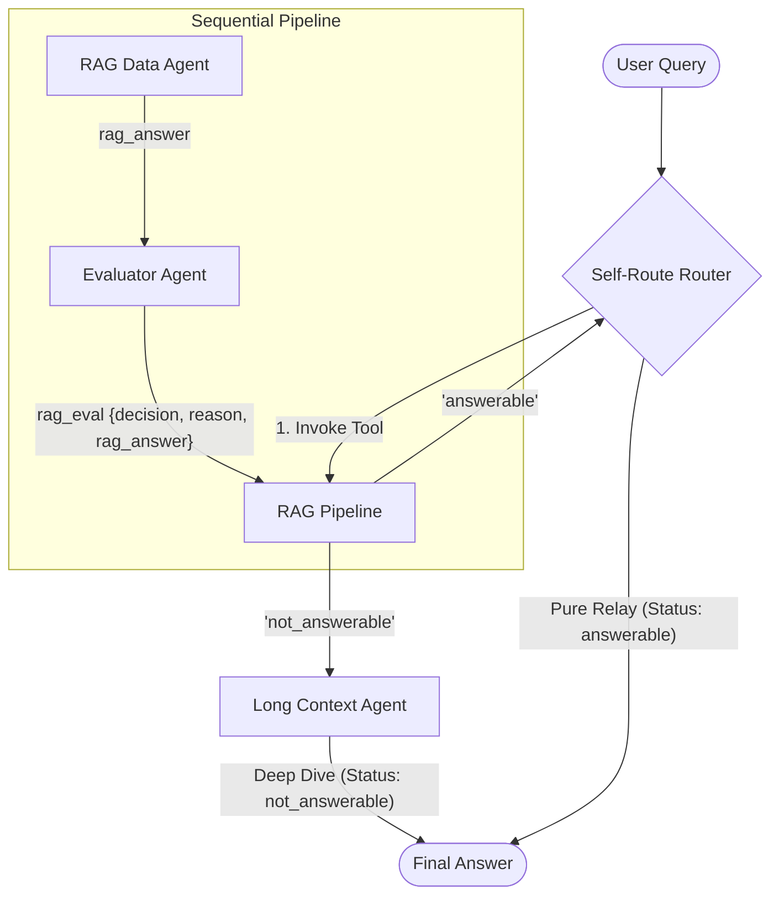

# Self-Route LLM Agent Architecture

> **Research Implementation**: This project is a practical implementation of **Self-Route**, a method introduced in the paper **["Retrieval Augmented Generation or Long-Context LLMs? A Comprehensive Study and Hybrid Approach"](https://arxiv.org/abs/2407.16833)** (arXiv:2407.16833). Self-Route reduces computation cost by dynamically routing queries to RAG or Long-Context LLMs based on model self-reflection.

## 🏗️ Core Architecture

The system utilizes a **Self-Reflective Router** that orchestrates between a high-speed RAG pipeline and a high-precision Long-Context fallback.



1. **RAG Data Agent** — Searches the Vertex AI Datastore. Strictly grounded to GlobalCorp policies.
2. **Evaluator Agent** — A structured Pydantic judge that validates the RAG output. If the result is ungrounded or missing, it issues a `not_answerable` signal.
3. **Long Context (LC) Agent** — The ultimate fallback. Ingests raw text files directly for deep reading comprehension, capturing details that RAG chunks might miss.

## 📂 Repository Structure

```
Self-Route LLM/
│
├── README.md                    # This file (Architecture & Setup)
├── generate_rag_files.py        # Procedurally generate .pdf / .docx for RAG Datastore
│
└── rag_lc_agent/
    ├── agent.py                 # Root Conversational Router (Self-Route entrypoint)
    ├── config.py                # Environment & Configuration manager
    ├── instructions.py          # Unified system prompts (RAG, Eval, LC, Router)
    ├── tool.py                  # Long Context ingestion utility
    │
    ├── subagents/               # Agent definitions
    │   ├── rag.py               # Vertex AI Search Agent
    │   ├── evaluator.py         # Structured Evaluator (Pydantic schema)
    │   └── long_context.py      # Full-context Fallback Agent
    │
    ├── tests/                   # Validation Framework
    │   ├── test_data.py         # 12 Categorized test cases (RAG Unique, LC > RAG, etc.)
    │   ├── eval_metrics.py      # LLM-as-a-Judge scoring (1-5 scale)
    │   └── run_evals.py         # Automated execution script → evaluation_results.csv
    │
    └── docs/                    # Ground-truth policies for Long Context Agent
        ├── remote_work_policy.txt
        ├── travel_policy.txt      # (NEW) Detailed Travel & Per Diem
        ├── code_of_conduct.txt
        └── parental_leave_appendix.txt # (NEW) Detailed edge cases
```

## ⚙️ Setup Instructions

### 1. Prerequisites

Python 3.10+ and a Google Cloud Project with Vertex AI Search enabled.

### 2. Install Dependencies

```bash
pip install -r requirements.txt
```

### 3. Configure Environment

Populate `rag_lc_agent/.env` with your `DATASTORE_RESOURCE` and `GOOGLE_CLOUD_PROJECT`.

### 4. Seed RAG Datastore

Run the generator and upload the resulting files from `rag_docs_to_upload/` to your Vertex AI Search datastore:

```bash
python generate_rag_files.py
```

## 🚀 Running the Agent

### Start Conversational Web UI

```bash
adk web
```

### Run Automated Evaluation Suite

```bash
python -m rag_lc_agent.tests.run_evals
```

This runs **12 baseline queries** and exports scores for **Correctness**, **Faithfulness**, and **Completeness** to `rag_lc_agent/tests/evaluation_results.csv`.

> [!NOTE]
> All test cases and ground truth data in this repository were generated using AI for research and demonstration purposes.

---

## ✍️ Author & Connect

If you found this project helpful, please **star the repository**! 🌟

- **Medium**: [Read more articles on AI & RAG](https://medium.com/@pandeyrahulraj99)
- **LinkedIn**: [Connect with me on LinkedIn](https://www.linkedin.com/in/rahulraj31/)
